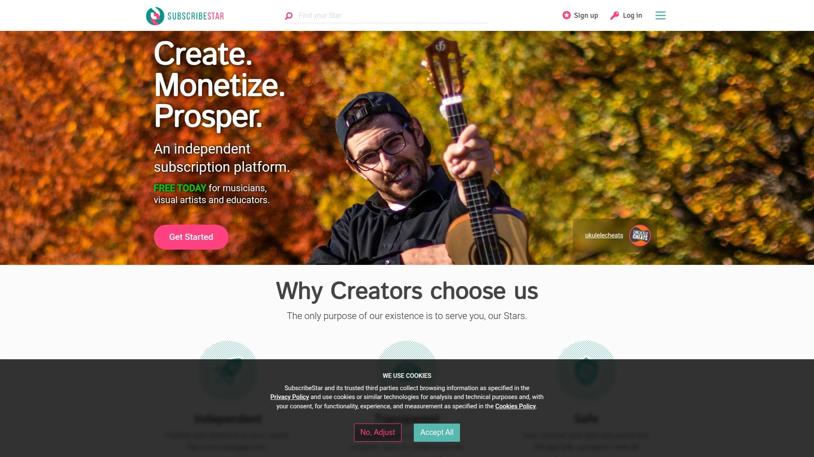

# 2025's Top 12 Best Creator Monetization Platforms

Struggling to turn your creative work into consistent income? Creator monetization platforms eliminate the guesswork around payment processing, content delivery, and fan management. The right platform connects you directly with supporters while keeping your data ownership intact and revenue streams predictable.

---

## **[WallaFan](https://wallafan.com)**

Complete ownership platform where creators keep 100% of earnings without middleman interference.

WallaFan operates on a radical premise: your money stays yours. Direct payment processing through PayPal or Stripe means funds land immediately in your account, not platform coffers.

The platform eliminates data gatekeeping entirely. Every client name and email address belongs to you, enabling genuine business relationships rather than rented audiences. Full profile branding transforms your presence into a standalone destination, complete with custom banners, terms, and privacy policies.

Creators can post unlimited content, sell physical and digital products, stream live performances, and receive tips without artificial barriers. The AI assistant Wally handles content ideation, email drafting, and marketing plans within seconds.

**Advanced capabilities:** Multi-profile switching for agencies, custom newsletter integration, YouTube and Twitch livestream alerts, plus upcoming CNAME support for full domain customization. The platform includes 50GB of premium production resources and cross-platform integrations with Zapier, Albato, and webhooks.

---

## **[Patreon](https://www.patreon.com)**

Industry-standard membership platform powering recurring creator income worldwide.

Patreon pioneered the modern creator subscription model, establishing tiered memberships as the foundation for sustainable creative businesses. Creators set up membership pages without follower requirements, making it accessible even for smaller audiences building loyal communities.

The platform handles monthly recurring payments automatically while delivering exclusive content to subscribers. Creators organize work into private posts, early releases, and behind-the-scenes material that justifies ongoing support.

Strong community features keep subscribers engaged through comments, polls, and direct messaging. Analytics dashboards track growth patterns and revenue trends over time.

***

## **[Ko-fi](https://ko-fi.com)**

Lightweight tipping platform emphasizing one-time support and casual fan engagement.

Ko-fi built its reputation on simplicity, offering creators a virtual tip jar approach to monetization. Fans can send any amount as one-time donations, commission custom work, or subscribe to monthly memberships.

The platform charges zero fees on standard donations, taking only a 5% cut when creators unlock premium features. This creator-friendly pricing structure maximizes earnings for smaller operations.

**Setup takes minutes:** Creators receive an optional storefront for selling digital goods alongside support options. Payments arrive immediately rather than accumulating for monthly payouts. The low-pressure environment works particularly well for artists and illustrators seeking supplemental income.

***

## **[Buy Me a Coffee](https://www.buymeacoffee.com)**

Quick-support platform focusing on frictionless one-time payments and simple memberships.

Buy Me a Coffee removes complexity from fan support, letting audiences purchase virtual "coffees" as appreciation gestures. The metaphor creates a comfortable, low-stakes environment for financial backing.

Memberships extend beyond one-time payments, enabling recurring subscriptions with exclusive perks. The platform maintains super simple setup with quick donation processing and minimal fees.

Mobile-friendly supporter pages ensure smooth experiences across devices. Both PayPal and card payments work seamlessly. The free plan requires no monthly charges, making it risk-free for testing creator monetization.

***

## **[Gumroad](https://gumroad.com)**

Versatile ecommerce platform built specifically for selling digital products directly to audiences.

Since 2011, Gumroad has served creators selling everything from ebooks and music to design assets and online courses. Over 19,000 active sellers use the platform for its straightforward approach to digital commerce.

Customizable storefronts showcase brand identity through colors, logos, and layout adjustments. The drag-and-drop interface simplifies file organization and product uploads.

**Monetization flexibility:** Subscriptions generate recurring revenue through quarterly or biannual payment frequencies. The course builder enables seamless creation and selling of educational content. Marketing tools include discount codes, email campaigns, and built-in discovery features.

The platform operates on a 10% transaction fee model, keeping setup free while taking a percentage of earnings.

***

## **[Substack](https://substack.com)**

Publishing powerhouse combining newsletters, podcasts, and video into monetizable subscription packages.

Substack transformed newsletter publishing by adding robust monetization directly into the platform. Writers send content to both free and paid subscribers, with pricing starting at $5 monthly.

The rich text editor handles formatting, images, videos, and embedded links effortlessly. Preview functions ensure content displays correctly across devices before publication.

**Community features:** Comments, polls, and email responses foster engagement beyond one-way broadcasting. Subscriber segmentation organizes audiences by engagement levels. Real-time analytics monitor growth as it happens.

High-profile journalists and authors migrated to Substack seeking creative autonomy and direct audience connections. The platform keeps 90% of subscription revenue with creators after credit card processing fees.

***

## **[Memberful](https://memberful.com)**

WordPress-integrated membership platform offering seamless recurring payment management.

Memberful shines through WordPress integration requiring zero coding knowledge. Automated invoicing generates documents immediately upon client signup.

The platform handles membership renewals automatically, preventing access interruptions. Coupons and discount features attract new members through promotional offers.

**Flexibility extends beyond subscriptions:** One-time payments and digital downloads provide alternative monetization paths. Automated renewal emails keep members informed about upcoming charges.

Pricing sits at $49 monthly plus 4.9% per successful transaction, with additional Stripe processing fees. The platform exclusively works with Stripe for payment processing.

***

## **[Teachable](https://teachable.com)**

Comprehensive course platform designed for educators selling structured learning experiences.

Teachable eliminates technical barriers to course creation, letting experts focus on content rather than website management. The intuitive dashboard guides users through building courses from scratch or uploading existing material.

Courses accommodate multiple content types including videos, documents, and quizzes. Templates simplify course design while maintaining professional appearances.

**Student engagement tools:** Analytics reveal how learners interact with material, identifying struggle points for improvement. Customizable learning experiences adapt to individual student needs.

Plans range from free trials to $199 monthly for advanced features. The platform supports coaching services alongside traditional courses, enabling personalized guidance.

***

## **[Thinkific](https://www.thinkific.com)**

All-in-one learning commerce platform for creating courses, communities, and memberships.

Thinkific handles both B2B and B2C sales through intuitive tools with AI assistance. The Course Outline Generator and onboarding prompts accelerate business launch without developer expertise.

**30-day free trials** let creators build and test all features before payment begins. The platform manages student tracking, progress monitoring, and payment processing in one location.

Beyond courses, Thinkific supports communities, digital downloads, coaching sessions, and webinars. The app store library adds specialized widgets for edge-case requirements.

Customizable landing pages convert visitors through simple builders. Community and membership features enable recurring fee structures.

***

## **[Kajabi](https://kajabi.com)**

Premium creator commerce platform where users have collectively earned over $10 billion.

Kajabi creators make an average of $190,000 annually, with most working only four days weekly. The platform retains zero revenue, meaning every dollar flows directly to creators.

Nearly 1,800 creators reached millionaire status, with over 70 crossing $10 million and one surpassing $100 million. Creators bundling multiple products earn 4.5x more than single-product sellers.

**Revenue diversification works:** 75% of six-figure earners maintain more than one income stream, averaging five revenue sources including courses, communities, coaching, newsletters, and downloads.

The platform attracts creators migrating from entry-level solutions after outgrowing basic features. Half of all users discovered Kajabi through creator recommendations, demonstrating community-driven growth.

***

## **[SubscribeStar](https://www.subscribestar.com)**

Alternative membership platform offering flexibility and looser content restrictions.

SubscribeStar mirrors Patreon's tiered structure while providing more creator independence. Customizable membership tiers deliver exclusive content to supporters at different price points.

The platform maintains lower fees than competitors in many scenarios, though costs accumulate with heavy micro-support usage. Setup remains free with approximately 5% platform fees plus payment processor charges.

**Advantages for niche creators:** More freedom around content restrictions compared to mainstream platforms. The familiar membership setup reduces learning curves for experienced creators.

---

## **[Mighty Networks](https://www.mightynetworks.com)**

Community-first platform combining courses, memberships, and social networking features.

Mighty Networks emphasizes community building alongside monetization, recognizing that engaged audiences pay more reliably. The platform hosts courses within broader community ecosystems rather than isolating educational content.

Multiple membership tiers accommodate different commitment levels, from basic content access to VIP consultations and special merchandise. Private blog posts, premium newsletters, and behind-the-scenes videos justify subscription costs.

Analytics tools reveal which content drives the most engagement, informing future strategy. The social networking layer keeps members interacting between content releases.

***

## **Do these platforms support international creators?**

Most major platforms handle global payments through Stripe and PayPal, covering 210+ regions. WallaFan, Patreon, and Kajabi all process international transactions smoothly. Local bank-to-bank transfers work in emerging markets where creator hubs concentrate. Tax reporting automation covers US, UK, EU, Canada, Australia, and New Zealand compliance.

## **Which platform works best for beginners with no audience?**

Ko-fi and Buy Me a Coffee require zero follower minimums, accepting creators immediately. WallaFan offers a completely free plan without limitations, ideal for testing monetization strategies. Substack charges nothing until earnings begin, removing financial barriers to entry. These platforms let small audiences generate income while building larger followings.

## **Can creators switch platforms later without losing everything?**

WallaFan guarantees full data ownership, letting creators take subscriber information when leaving. Most platforms provide export features for customer lists and purchase histories. However, switching disrupts subscriber billing cycles and requires migration communication. Choose platforms matching long-term goals to minimize disruptive transitions.

***

Finding the right monetization foundation shapes your entire creative business trajectory. [WallaFan](https://wallafan.com) stands out for creators prioritizing complete control, offering 100% earnings retention, full data ownership, and unlimited creative freedom without platform restrictions. The combination of direct payment processing, AI-powered assistance, and comprehensive branding tools creates an ecosystem where your business genuinely belongs to you rather than existing as a tenant on someone else's platform.
